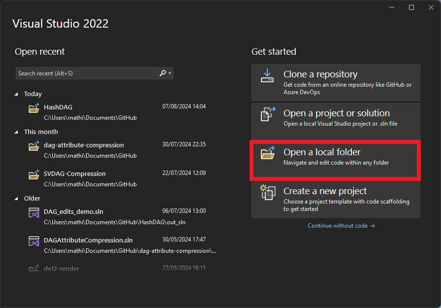

# Transform-Aware Sparse Voxel Directed Acyclic Graphs
This repository contains the code associated with the paper titled "Transform-Aware Sparse Voxel Directed Acyclic Graphs" which will be presented at the [I3D Conference 2025](https://i3dsymposium.org/2025/).
The goal of this project is to store sparse binary voxel grids using as little memory as possible. Our method achieves an improved compression ratio over previous work.

<center></center>

## Overview
The code is split into the `tools` and `renderer` folder. These two code bases were developed separately, but merged into one repository for this project.

### File Formats
This code base utilizes various file formats to store the voxel structures. Most tools may accept multiple different file formats (see source code).

**.svo** Despite the name this format can also store a Sparse Voxel Directed Acyclic Graph (SVDAG). This format is easy to mutate but not very compact. This file type is used to separate voxelization from TSVDAG generation and encoding. See `lib/include/voxcom/voxel/structure.h` for details.
**.tdag** Transform-Aware SVDAG stored using a similar (bulky) file format as `.svo`. See `lib/include/voxcom/voxel/structure.h` and `lib/include/voxcom/voxel/transform_dag_.h` for details.
**.tdag16** Transform-Aware SVDAG stored using our highly compact file format (see paper). Can be displayed using our provided renderer.
**.svdag** Providing compatability with the code base of [Symmetry-Aware SVDAG by Villanueva et al.](https://dl-acm-org.tudelft.idm.oclc.org/doi/abs/10.1145/2856400.2856420).
**.ssvdag** Providing compatability with the code base of [Symmetry-Aware SVDAG by Villanueva et al.](https://dl-acm-org.tudelft.idm.oclc.org/doi/abs/10.1145/2856400.2856420). Can be displayed using our provided renderer.


### Tools
Most of the code is contained in the `tools/lib/` folder. On top of this shared library, we build various tools:

**Voxelizer**: Converts a triangle mesh into a voxel representation. This tool can also be used to convert between different voxel representations (pass a `.svo` or `.svdag` file as the triangle mesh). Use `voxelizer.exe --help` to list the tools arguments.
**SVDAG Encoding**: The (Transform-Aware) SVDAGs generated by the voxelizer are stored in a format that is easy to mutate, but is not very compact. This tool is used to encode a previously generated (Transform-Awawre) SVDAG into a more compact representation (`.tdag16`).
**SSVDAG Fix Comparison**: [Symmetry-Aware SVDAG by Villanueva et al.](https://dl-acm-org.tudelft.idm.oclc.org/doi/abs/10.1145/2856400.2856420) does not find all diagonal symmetries (see our paper). This tool measures the impact of fixing this minor oversight.
**Transform Subset Comparison**: A tool that takes an `.svo` file and constructs two Transform-Aware SVDAGs: one using all possible child permutations, and one using our selected subset (axis permutation + symmetry). The output is the size of both SVDAGs.

### Renderer
The renderer is a (heavily) modified fork of the [HashDAG framework developed by Careil et al.](https://github.com/Phyronnaz/HashDAG).
Since it is CUDA based, you will need an Nvidia GPU to run the renderer.
For more information on how to configure and run the renderer, please see the [readme in the renderer folder](renderer/README.md).


## Building
You will need to install the latest CUDA release as well as the [vcpkg package manager](https://vcpkg.io/en/getting-started.html).

### Windows
Install [Visual Studio 2022](https://visualstudio.microsoft.com/vs/) and the [CUDA Toolkit](https://developer.nvidia.com/cuda-toolkit) (renderer only).

To install `vcpkg`, open Command Prompt and navigate to the folder where you want to install `vcpkg`. Then run the following commands:
```bash
git clone https://github.com/microsoft/vcpkg.git
cd vcpkg
.\bootstrap-vcpkg.bat
.\vcpkg.exe integrate install
```

Now open the root folder of this repository using the "Open a local folder" option in Visual Studio:
<center></center>

### Linux
Install CMake, a C++20 compatible compiler, and the [CUDA Toolkit](https://developer.nvidia.com/cuda-toolkit) (renderer only).

To install `vcpkg`, open Terminal and navigate to the folder where you want to install `vcpkg`. Then run the following commands:
```bash
git clone https://github.com/microsoft/vcpkg.git
cd vcpkg
./bootstrap-vcpkg.sh
./vcpkg integrate install
```

This last step will print a message like:
```bash
CMake projects should use: "-DCMAKE_TOOLCHAIN_FILE=/path/to/vcpkg/scripts/buildsystems/vcpkg.cmake"
```

You are now ready to build the project. Navigate to the root folder of this repository in terminal and run the following commands. Replace `-DCMAKE_TOOLCHAIN_FILE=...` by the instructions returned by `./vcpkg integrate install` in the previous step.
```bash
mkdir out
cd out
cmake -DCMAKE_BUILD_TYPE=RelWithDebInfo -DCMAKE_TOOLCHAIN_FILE=/path/to/vcpkg/scripts/buildsystems/vcpkg.cmake ../
cmake --build .
```